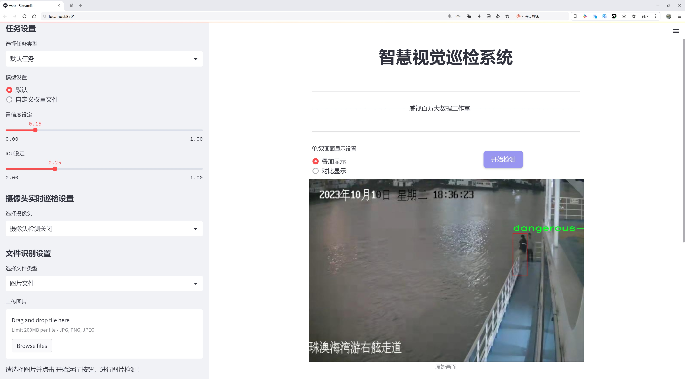
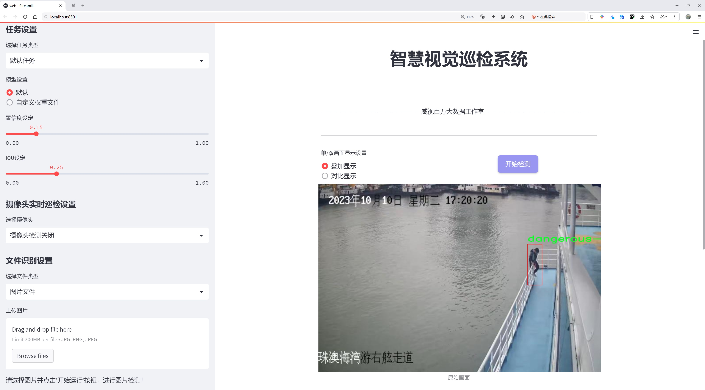
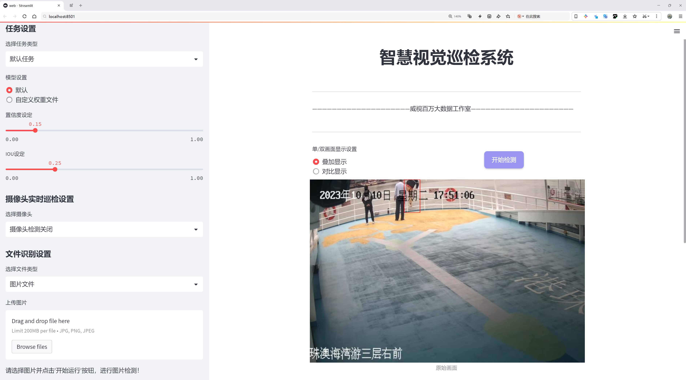
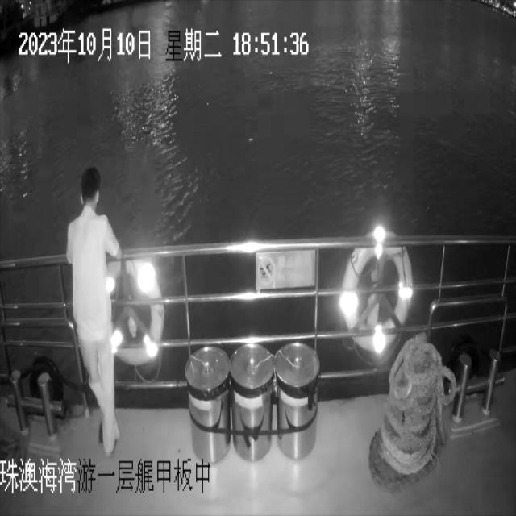
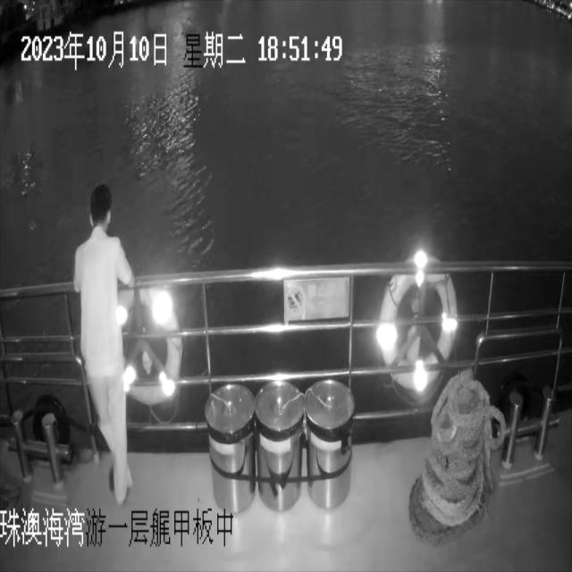
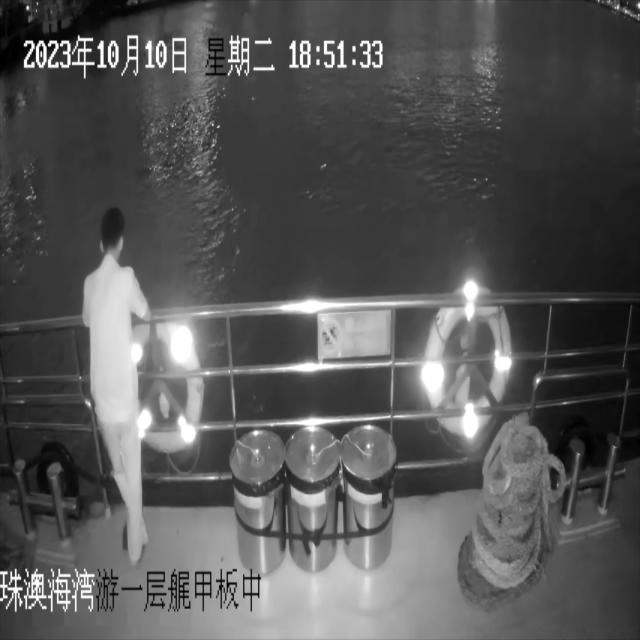
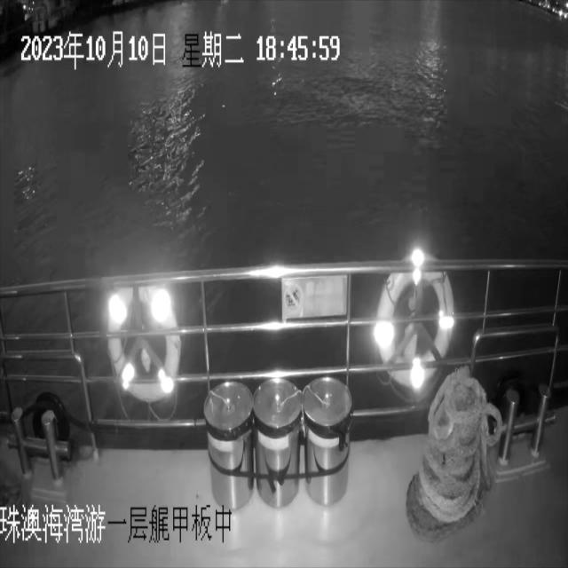

# 轻生人员检测检测系统源码分享
 # [一条龙教学YOLOV8标注好的数据集一键训练_70+全套改进创新点发刊_Web前端展示]

### 1.研究背景与意义

项目参考[AAAI Association for the Advancement of Artificial Intelligence](https://gitee.com/qunshansj/projects)

项目来源[AACV Association for the Advancement of Computer Vision](https://gitee.com/qunmasj/projects)

研究背景与意义

随着城市化进程的加快和人口密度的增加，公共安全问题日益凸显，尤其是在人员密集的场所，危险行为的发生频率显著上升。这些危险行为不仅对个体的生命安全构成威胁，也可能引发更大范围的社会安全隐患。因此，及时、准确地检测和识别危险行为，成为了社会治理和公共安全管理的重要任务。近年来，计算机视觉技术的快速发展为这一问题的解决提供了新的思路，尤其是基于深度学习的目标检测算法在实时监控和行为识别领域展现出了巨大的潜力。

YOLO（You Only Look Once）系列算法作为目标检测领域的代表性方法，以其高效的实时检测能力和较高的准确率，逐渐成为研究的热点。YOLOv8作为该系列的最新版本，结合了多种先进的技术，进一步提升了检测精度和速度。然而，尽管YOLOv8在通用目标检测任务中表现出色，但在特定场景下，如危险行为检测，仍存在一定的局限性。这主要体现在对复杂环境下的行为特征提取能力不足，以及对小样本数据集的适应性较差。因此，针对YOLOv8进行改进，以提升其在轻生人员检测中的应用效果，具有重要的理论和实践意义。

本研究基于JumpD-Dangerous数据集，旨在构建一个高效的轻生人员检测系统。该数据集包含7400幅图像，专注于危险行为的识别，提供了一个良好的基础以训练和验证改进后的YOLOv8模型。通过对数据集的深入分析，我们可以识别出危险行为的多样性和复杂性，这为模型的改进提供了丰富的背景信息。具体而言，研究将重点关注如何通过改进网络结构、优化损失函数和增强数据集等方式，提升模型对危险行为的检测能力。

此外，轻生人员检测系统的研究不仅有助于提高公共安全管理的效率，也为相关领域的研究提供了新的思路和方法。通过实现对危险行为的实时监测和预警，能够有效降低事故发生的概率，保护个体的生命安全。同时，该系统的应用前景广泛，涵盖了公共场所监控、校园安全、心理健康干预等多个领域，具有显著的社会价值和经济效益。

综上所述，基于改进YOLOv8的轻生人员检测系统的研究，不仅能够推动目标检测技术在特定应用场景中的发展，也为社会安全管理提供了切实可行的解决方案。通过深入探讨危险行为的检测方法，提升模型的适应性和准确性，本研究将为构建更安全的社会环境贡献一份力量。

### 2.图片演示







##### 注意：由于此博客编辑较早，上面“2.图片演示”和“3.视频演示”展示的系统图片或者视频可能为老版本，新版本在老版本的基础上升级如下：（实际效果以升级的新版本为准）

  （1）适配了YOLOV8的“目标检测”模型和“实例分割”模型，通过加载相应的权重（.pt）文件即可自适应加载模型。

  （2）支持“图片识别”、“视频识别”、“摄像头实时识别”三种识别模式。

  （3）支持“图片识别”、“视频识别”、“摄像头实时识别”三种识别结果保存导出，解决手动导出（容易卡顿出现爆内存）存在的问题，识别完自动保存结果并导出到tempDir中。

  （4）支持Web前端系统中的标题、背景图等自定义修改，后面提供修改教程。

  另外本项目提供训练的数据集和训练教程,暂不提供权重文件（best.pt）,需要您按照教程进行训练后实现图片演示和Web前端界面演示的效果。

### 3.视频演示

[3.1 视频演示](https://www.bilibili.com/video/BV1bCtjedEGf/)

### 4.数据集信息展示

##### 4.1 本项目数据集详细数据（类别数＆类别名）

nc: 1
names: ['dangerous-behavior']


##### 4.2 本项目数据集信息介绍

数据集信息展示

在现代计算机视觉领域，轻生人员检测系统的研究逐渐成为一个重要的课题，尤其是在公共安全和心理健康领域。为此，我们引入了名为“JumpD-Dangerous”的数据集，旨在为改进YOLOv8模型提供高质量的训练数据，以提升其在检测轻生行为方面的准确性和鲁棒性。该数据集专注于捕捉和识别与轻生相关的危险行为，具体类别数量为1，类别名称为“dangerous-behavior”。

“JumpD-Dangerous”数据集的构建基于多种真实场景的监控视频和图像，涵盖了多种可能导致轻生的行为模式。通过精心筛选和标注，数据集确保了高质量的样本，能够有效反映出在不同环境下个体可能表现出的危险行为。这一类别的定义不仅限于单一的行为模式，而是包括了一系列复杂的情境和动态，例如高处徘徊、情绪失控、以及可能的自残行为等。这种多样性使得数据集在训练过程中能够提供丰富的特征信息，帮助模型更好地理解和识别轻生行为的微妙差异。

数据集的标注过程经过严格的审核和验证，确保每一帧图像都准确地反映出危险行为的发生。标注团队由经验丰富的心理学家和计算机视觉专家组成，他们共同制定了详细的标注标准，以确保数据的一致性和可靠性。通过这种方式，数据集不仅为YOLOv8模型的训练提供了坚实的基础，也为后续的研究提供了宝贵的参考资料。

在数据集的规模方面，“JumpD-Dangerous”包含了数千张经过精细标注的图像，涵盖了多种不同的光照条件、天气状况和背景环境。这种多样性不仅增强了模型的泛化能力，也使得其在实际应用中能够更好地适应各种复杂场景。此外，数据集还包括了一些合成数据，通过数据增强技术生成的图像，进一步丰富了训练样本的多样性，提升了模型的鲁棒性。

为了方便研究人员和开发者使用，“JumpD-Dangerous”数据集提供了详细的文档和使用指南，涵盖了数据集的获取、预处理、标注信息以及模型训练的最佳实践。这些资源旨在帮助用户快速上手，并有效利用数据集进行模型训练和评估。

总之，“JumpD-Dangerous”数据集不仅是一个用于训练YOLOv8的强大工具，更是推动轻生人员检测研究的重要资源。通过对危险行为的深入分析和精准标注，该数据集为提升公共安全和心理健康监测提供了新的可能性。未来，随着技术的不断进步和数据集的进一步扩展，我们期待能够在这一领域取得更大的突破，为社会带来更安全的环境。










### 5.全套项目环境部署视频教程（零基础手把手教学）

[5.1 环境部署教程链接（零基础手把手教学）](https://www.ixigua.com/7404473917358506534?logTag=c807d0cbc21c0ef59de5)


[5.2 安装Python虚拟环境创建和依赖库安装视频教程链接（零基础手把手教学）](https://www.ixigua.com/7404474678003106304?logTag=1f1041108cd1f708b01a)

### 6.手把手YOLOV8训练视频教程（零基础小白有手就能学会）

[6.1 手把手YOLOV8训练视频教程（零基础小白有手就能学会）](https://www.ixigua.com/7404477157818401292?logTag=d31a2dfd1983c9668658)

### 7.70+种全套YOLOV8创新点代码加载调参视频教程（一键加载写好的改进模型的配置文件）

[7.1 70+种全套YOLOV8创新点代码加载调参视频教程（一键加载写好的改进模型的配置文件）](https://www.ixigua.com/7404478314661806627?logTag=29066f8288e3f4eea3a4)

### 8.70+种全套YOLOV8创新点原理讲解（非科班也可以轻松写刊发刊，V10版本正在科研待更新）

由于篇幅限制，每个创新点的具体原理讲解就不一一展开，具体见下列网址中的创新点对应子项目的技术原理博客网址【Blog】：


[8.1 70+种全套YOLOV8创新点原理讲解链接](https://gitee.com/qunmasj/good)

### 9.系统功能展示（检测对象为举例，实际内容以本项目数据集为准）

图9.1.系统支持检测结果表格显示

  图9.2.系统支持置信度和IOU阈值手动调节

  图9.3.系统支持自定义加载权重文件best.pt(需要你通过步骤5中训练获得)

  图9.4.系统支持摄像头实时识别

  图9.5.系统支持图片识别

  图9.6.系统支持视频识别

  图9.7.系统支持识别结果文件自动保存

  图9.8.系统支持Excel导出检测结果数据


### 10.原始YOLOV8算法原理

原始YOLOv8算法原理

YOLOv8算法是由Ultralytics公司于2023年1月10日发布的最新版本，标志着YOLO系列目标检测算法的又一次重要进化。作为YOLOv7的继承者，YOLOv8在多个方面进行了深度优化，尤其是在网络结构、检测精度和处理速度上，展现出了显著的提升。其核心理念依然是基于卷积神经网络（CNN），但通过引入更深的网络结构和多种新技术，使得YOLOv8在目标检测任务中表现得更加卓越。

YOLOv8的基本原理是将整个输入图像作为一个整体进行处理，而不是依赖于传统的滑动窗口或区域提议方法。这种全图处理的方式大大提高了检测的速度和精度。YOLOv8的网络结构主要由三个部分组成：Backbone、Neck和Head。Backbone部分负责特征提取，利用深层卷积网络来捕捉图像中的各种特征信息。Neck部分则通过多尺度特征融合技术，将来自Backbone不同层次的特征图进行整合，以便更好地识别不同尺度的目标。这种特征融合不仅提升了检测的性能，也增强了模型的鲁棒性。最后，Head部分负责最终的目标检测和分类任务，通过多个解耦的检测头，生成检测结果。

在Backbone部分，YOLOv8采用了一系列的卷积层和反卷积层，并引入了残差连接和瓶颈结构，以减小网络的参数量并提高性能。具体来说，Backbone由多个CBS模块、C2f模块和一个快速空间金字塔池化（SPPF）模块组成，这些模块的组合使得特征提取过程更加高效。通过这种结构，YOLOv8能够在不同的层次上提取到丰富的特征信息，从而为后续的目标检测打下坚实的基础。

Neck部分的设计是YOLOv8的一大亮点。它采用了多尺度特征融合技术，将来自不同层次的特征图进行整合，以便更好地捕捉到不同尺度目标的信息。这种特征融合的方式使得YOLOv8在面对各种大小的目标时，能够保持较高的检测精度和稳定性。尤其是在复杂场景下，目标的尺度变化往往会对检测结果产生影响，而YOLOv8通过这种设计有效地缓解了这一问题。

在Head部分，YOLOv8设有三个解耦的检测头，分别用于处理不同尺寸的信息。这种设计使得模型能够更灵活地应对各种目标的检测任务。每个检测头内部包含一系列的卷积层和反卷积层，通过这些层的组合，YOLOv8能够生成高质量的检测结果。最终，模型输出的结果不仅包括目标的类别信息，还包含了目标的位置信息，从而实现了精确的目标检测。

YOLOv8的另一个重要特性是其在训练和测试过程中引入了多尺度训练和测试技术。这种技术使得模型在训练时能够接触到不同尺度的图像，从而提高了模型的泛化能力。在测试阶段，YOLOv8同样能够处理不同尺寸的输入图像，确保在实际应用中具备良好的适应性。这种灵活性使得YOLOv8能够广泛应用于智能监控、自动驾驶、人脸识别等多个领域，满足不同场景下的目标检测需求。

此外，YOLOv8在精度和速度上的提升也是其一大亮点。与前一版本YOLOv7相比，YOLOv8在平均精度均值（mAP）上提高了43.23%，而帧率则提升了10.28倍。这一显著的性能提升，使得YOLOv8在实时目标检测任务中表现得更加出色，能够满足高效处理的需求。通过与其他目标检测算法的比较，YOLOv8不仅在精度上取得了突破性进展，同时在处理速度上也具备了显著优势，进一步巩固了其在目标检测领域的领先地位。

综上所述，YOLOv8算法的原理和结构设计充分体现了其在目标检测任务中的创新与进步。通过深度的卷积神经网络结构、有效的特征融合技术以及灵活的检测头设计，YOLOv8不仅提高了检测精度和速度，还增强了模型的适应性和鲁棒性。这些特性使得YOLOv8成为当前业界最流行和成功的目标检测算法之一，为各种实际应用提供了强有力的支持。随着YOLOv8的广泛应用，未来在目标检测领域的研究和发展将会更加深入，推动智能视觉技术的不断进步。


### 11.项目核心源码讲解（再也不用担心看不懂代码逻辑）

#### 11.1 70+种YOLOv8算法改进源码大全和调试加载训练教程（非必要）\ultralytics\nn\backbone\CSwomTramsformer.py

以下是对给定代码的核心部分进行提炼和详细注释的结果。代码主要实现了一个基于CSWin Transformer的视觉模型。

```python
import torch
import torch.nn as nn
import numpy as np

class Mlp(nn.Module):
    """多层感知机（MLP）模块"""
    def __init__(self, in_features, hidden_features=None, out_features=None, act_layer=nn.GELU, drop=0.):
        super().__init__()
        out_features = out_features or in_features  # 输出特征数
        hidden_features = hidden_features or in_features  # 隐藏层特征数
        self.fc1 = nn.Linear(in_features, hidden_features)  # 第一层线性变换
        self.act = act_layer()  # 激活函数
        self.fc2 = nn.Linear(hidden_features, out_features)  # 第二层线性变换
        self.drop = nn.Dropout(drop)  # Dropout层

    def forward(self, x):
        """前向传播"""
        x = self.fc1(x)  # 线性变换
        x = self.act(x)  # 激活
        x = self.drop(x)  # Dropout
        x = self.fc2(x)  # 线性变换
        x = self.drop(x)  # Dropout
        return x

class LePEAttention(nn.Module):
    """局部增强位置编码注意力模块"""
    def __init__(self, dim, resolution, idx, split_size=7, num_heads=8, attn_drop=0.):
        super().__init__()
        self.dim = dim  # 输入特征维度
        self.resolution = resolution  # 输入分辨率
        self.split_size = split_size  # 切分窗口大小
        self.num_heads = num_heads  # 注意力头数
        head_dim = dim // num_heads  # 每个头的维度
        self.scale = head_dim ** -0.5  # 缩放因子

        # 计算窗口的高度和宽度
        if idx == -1:
            self.H_sp, self.W_sp = resolution, resolution
        elif idx == 0:
            self.H_sp, self.W_sp = resolution, split_size
        elif idx == 1:
            self.W_sp, self.H_sp = resolution, split_size
        else:
            raise ValueError("ERROR MODE")

        self.get_v = nn.Conv2d(dim, dim, kernel_size=3, stride=1, padding=1, groups=dim)  # 卷积层用于获取v
        self.attn_drop = nn.Dropout(attn_drop)  # 注意力Dropout

    def im2cswin(self, x):
        """将输入转换为窗口格式"""
        B, N, C = x.shape
        H = W = int(np.sqrt(N))  # 计算高度和宽度
        x = x.transpose(-2, -1).contiguous().view(B, C, H, W)  # 转换形状
        x = img2windows(x, self.H_sp, self.W_sp)  # 切分为窗口
        x = x.reshape(-1, self.H_sp * self.W_sp, self.num_heads, C // self.num_heads).permute(0, 2, 1, 3).contiguous()
        return x

    def forward(self, qkv):
        """前向传播"""
        q, k, v = qkv[0], qkv[1], qkv[2]  # 获取q, k, v
        q = self.im2cswin(q)  # 将q转换为窗口格式
        k = self.im2cswin(k)  # 将k转换为窗口格式
        v = self.get_v(v)  # 获取v的增强位置编码

        q = q * self.scale  # 缩放q
        attn = (q @ k.transpose(-2, -1))  # 计算注意力权重
        attn = nn.functional.softmax(attn, dim=-1)  # softmax归一化
        attn = self.attn_drop(attn)  # Dropout

        x = attn @ v  # 计算输出
        return x

class CSWinBlock(nn.Module):
    """CSWin Transformer的基本块"""
    def __init__(self, dim, reso, num_heads, split_size=7, mlp_ratio=4.):
        super().__init__()
        self.dim = dim  # 输入特征维度
        self.num_heads = num_heads  # 注意力头数
        self.patches_resolution = reso  # 输入分辨率
        self.split_size = split_size  # 切分窗口大小
        self.qkv = nn.Linear(dim, dim * 3)  # 线性层用于生成q, k, v
        self.norm1 = nn.LayerNorm(dim)  # 归一化层

        self.attn = LePEAttention(dim, resolution=self.patches_resolution, idx=0, split_size=self.split_size, num_heads=self.num_heads)  # 注意力层
        self.mlp = Mlp(in_features=dim, hidden_features=int(dim * mlp_ratio), out_features=dim)  # MLP层
        self.norm2 = nn.LayerNorm(dim)  # 归一化层

    def forward(self, x):
        """前向传播"""
        img = self.norm1(x)  # 归一化
        qkv = self.qkv(img).reshape(x.shape[0], -1, 3, self.dim).permute(2, 0, 1, 3)  # 生成q, k, v
        x = self.attn(qkv)  # 计算注意力
        x = x + self.mlp(self.norm2(x))  # MLP处理
        return x

class CSWinTransformer(nn.Module):
    """CSWin Transformer模型"""
    def __init__(self, img_size=640, in_chans=3, num_classes=1000, embed_dim=96, depth=[2, 2, 6, 2]):
        super().__init__()
        self.num_classes = num_classes
        self.embed_dim = embed_dim  # 嵌入维度

        # 输入嵌入层
        self.stage1_conv_embed = nn.Sequential(
            nn.Conv2d(in_chans, embed_dim, 7, 4, 2),  # 卷积层
            nn.LayerNorm(embed_dim)  # 归一化层
        )

        # CSWin块
        self.stage1 = nn.ModuleList([
            CSWinBlock(dim=embed_dim, num_heads=12, reso=img_size // 4) for _ in range(depth[0])
        ])

        # 其他阶段的CSWin块
        self.stage2 = nn.ModuleList([
            CSWinBlock(dim=embed_dim * 2, num_heads=12, reso=img_size // 8) for _ in range(depth[1])
        ])

    def forward(self, x):
        """前向传播"""
        x = self.stage1_conv_embed(x)  # 输入嵌入
        for blk in self.stage1:
            x = blk(x)  # 通过CSWin块
        for blk in self.stage2:
            x = blk(x)  # 通过CSWin块
        return x

# 示例模型创建和前向传播
if __name__ == '__main__':
    inputs = torch.randn((1, 3, 640, 640))  # 随机输入
    model = CSWinTransformer()  # 创建模型
    res = model(inputs)  # 前向传播
    print(res.size())  # 输出结果尺寸
```

### 代码说明：
1. **Mlp类**：实现了一个简单的多层感知机，包含两层线性变换和激活函数，支持Dropout。
2. **LePEAttention类**：实现了局部增强位置编码的注意力机制，支持输入的窗口化处理。
3. **CSWinBlock类**：构建了CSWin Transformer的基本模块，包含注意力层和MLP层。
4. **CSWinTransformer类**：整体模型，包含输入嵌入层和多个CSWin块的堆叠。

### 主要功能：
- 该模型适用于图像分类任务，使用CSWin Transformer架构来处理输入图像。
- 通过模块化设计，便于扩展和修改。

该文件实现了CSWin Transformer模型，这是一个用于计算机视觉任务的深度学习模型，具有处理图像的能力。代码的开头部分包含了版权信息和必要的库导入，包括PyTorch和一些其他的工具库。

首先，定义了一个名为`Mlp`的类，它是一个多层感知机（MLP），包含两个线性层和一个激活函数（默认为GELU）。该类的`forward`方法定义了前向传播过程。

接下来，定义了`LePEAttention`类，这个类实现了一种新的注意力机制，名为局部增强位置编码（LePE）。在这个类中，输入的特征图被分割成窗口，并通过卷积层进行处理。该类的`forward`方法计算了查询、键和值的注意力，并结合了位置编码。

然后，定义了`CSWinBlock`类，这是CSWin Transformer的基本构建块。它结合了MLP和注意力机制，进行特征提取。该类的`forward`方法首先对输入进行归一化，然后计算查询、键和值，并通过注意力机制处理这些特征。

接着，定义了两个辅助函数`img2windows`和`windows2img`，用于将图像分割成窗口和将窗口合并回图像。

`Merge_Block`类用于在不同阶段之间合并特征图，通过卷积层和归一化层进行处理。

`CSWinTransformer`类是整个模型的核心，包含多个阶段的构建块。它的构造函数定义了输入图像的大小、嵌入维度、类别数等参数，并构建了不同阶段的块和合并层。该类的`forward_features`方法负责提取特征，并在每个阶段之间进行合并。

此外，文件中还定义了一些辅助函数，例如`_conv_filter`和`update_weight`，用于处理模型权重的加载和更新。

最后，提供了四个函数`CSWin_tiny`、`CSWin_small`、`CSWin_base`和`CSWin_large`，用于创建不同规模的CSWin Transformer模型，并可选择加载预训练权重。

在文件的最后部分，提供了一个简单的测试示例，创建了不同规模的模型并输入随机生成的图像数据，输出每个模型的特征图尺寸。

整体来看，该文件实现了CSWin Transformer模型的各个组成部分，适用于图像分类等计算机视觉任务，具有良好的灵活性和可扩展性。

#### 11.2 ui.py

以下是保留的核心代码部分，并附上详细的中文注释：

```python
import sys
import subprocess

def run_script(script_path):
    """
    使用当前 Python 环境运行指定的脚本。

    Args:
        script_path (str): 要运行的脚本路径

    Returns:
        None
    """
    # 获取当前 Python 解释器的路径
    python_path = sys.executable

    # 构建运行命令，使用 streamlit 运行指定的脚本
    command = f'"{python_path}" -m streamlit run "{script_path}"'

    # 执行命令
    result = subprocess.run(command, shell=True)
    # 检查命令执行结果，如果返回码不为0，表示出错
    if result.returncode != 0:
        print("脚本运行出错。")

# 主程序入口
if __name__ == "__main__":
    # 指定要运行的脚本路径
    script_path = "web.py"  # 这里可以替换为实际的脚本路径

    # 调用函数运行脚本
    run_script(script_path)
```

### 代码注释说明：
1. **导入模块**：
   - `sys`：用于访问与 Python 解释器相关的变量和函数。
   - `subprocess`：用于执行外部命令。

2. **定义 `run_script` 函数**：
   - 该函数接受一个参数 `script_path`，表示要运行的 Python 脚本的路径。
   - 使用 `sys.executable` 获取当前 Python 解释器的路径，以确保在正确的环境中运行脚本。
   - 构建命令字符串，使用 `streamlit` 模块运行指定的脚本。
   - 使用 `subprocess.run` 执行构建的命令，并检查返回码以判断脚本是否成功运行。

3. **主程序入口**：
   - 在 `if __name__ == "__main__":` 块中，指定要运行的脚本路径，并调用 `run_script` 函数执行该脚本。

这个程序文件的主要功能是通过当前的 Python 环境来运行一个指定的脚本，具体来说是运行一个名为 `web.py` 的脚本。文件首先导入了必要的模块，包括 `sys`、`os` 和 `subprocess`，以及一个自定义的 `abs_path` 函数，用于获取脚本的绝对路径。

在 `run_script` 函数中，首先获取当前 Python 解释器的路径，这样可以确保使用正确的 Python 环境来执行脚本。接着，构建一个命令字符串，该命令使用 `streamlit` 模块来运行指定的脚本。`streamlit` 是一个用于构建数据应用的流行库，通常用于快速开发和展示数据可视化应用。

然后，使用 `subprocess.run` 方法来执行构建好的命令。这个方法会在一个新的子进程中运行命令，并等待其完成。如果命令执行后返回的状态码不为零，表示脚本运行过程中出现了错误，此时程序会打印出“脚本运行出错”的提示信息。

在文件的最后部分，使用 `if __name__ == "__main__":` 语句来确保只有在直接运行该文件时才会执行后面的代码。这里指定了要运行的脚本路径为 `web.py`，并调用 `run_script` 函数来执行该脚本。

总体来说，这个程序文件提供了一种简便的方式来启动一个基于 Streamlit 的 Python 应用，确保在正确的环境中运行，并能够处理可能出现的错误。

#### 11.3 code\ultralytics\nn\modules\conv.py

以下是代码中最核心的部分，并附上详细的中文注释：

```python
import math
import torch
import torch.nn as nn

def autopad(k, p=None, d=1):  # kernel, padding, dilation
    """自动填充以保持输出形状不变。"""
    if d > 1:
        # 如果膨胀(dilation)大于1，计算实际的卷积核大小
        k = d * (k - 1) + 1 if isinstance(k, int) else [d * (x - 1) + 1 for x in k]
    if p is None:
        # 如果没有指定填充，则自动计算填充大小
        p = k // 2 if isinstance(k, int) else [x // 2 for x in k]
    return p

class Conv(nn.Module):
    """标准卷积层，包含输入通道、输出通道、卷积核大小、步幅、填充、分组、膨胀和激活函数等参数。"""

    default_act = nn.SiLU()  # 默认激活函数

    def __init__(self, c1, c2, k=1, s=1, p=None, g=1, d=1, act=True):
        """初始化卷积层，设置卷积、批归一化和激活函数。"""
        super().__init__()
        # 创建卷积层
        self.conv = nn.Conv2d(c1, c2, k, s, autopad(k, p, d), groups=g, dilation=d, bias=False)
        # 创建批归一化层
        self.bn = nn.BatchNorm2d(c2)
        # 设置激活函数
        self.act = self.default_act if act is True else act if isinstance(act, nn.Module) else nn.Identity()

    def forward(self, x):
        """前向传播：应用卷积、批归一化和激活函数。"""
        return self.act(self.bn(self.conv(x)))

class DWConv(Conv):
    """深度卷积层，针对每个输入通道单独进行卷积。"""

    def __init__(self, c1, c2, k=1, s=1, d=1, act=True):
        """初始化深度卷积层，设置输入通道、输出通道、卷积核大小、步幅、膨胀和激活函数。"""
        super().__init__(c1, c2, k, s, g=math.gcd(c1, c2), d=d, act=act)

class ConvTranspose(nn.Module):
    """转置卷积层。"""

    default_act = nn.SiLU()  # 默认激活函数

    def __init__(self, c1, c2, k=2, s=2, p=0, bn=True, act=True):
        """初始化转置卷积层，设置批归一化和激活函数。"""
        super().__init__()
        self.conv_transpose = nn.ConvTranspose2d(c1, c2, k, s, p, bias=not bn)
        self.bn = nn.BatchNorm2d(c2) if bn else nn.Identity()
        self.act = self.default_act if act is True else act if isinstance(act, nn.Module) else nn.Identity()

    def forward(self, x):
        """前向传播：应用转置卷积、批归一化和激活函数。"""
        return self.act(self.bn(self.conv_transpose(x)))

class ChannelAttention(nn.Module):
    """通道注意力模块。"""

    def __init__(self, channels: int) -> None:
        """初始化通道注意力模块，设置基本配置。"""
        super().__init__()
        self.pool = nn.AdaptiveAvgPool2d(1)  # 自适应平均池化
        self.fc = nn.Conv2d(channels, channels, 1, 1, 0, bias=True)  # 1x1卷积
        self.act = nn.Sigmoid()  # Sigmoid激活函数

    def forward(self, x: torch.Tensor) -> torch.Tensor:
        """前向传播：应用通道注意力机制。"""
        return x * self.act(self.fc(self.pool(x)))

class CBAM(nn.Module):
    """卷积块注意力模块。"""

    def __init__(self, c1, kernel_size=7):
        """初始化CBAM模块，设置输入通道和卷积核大小。"""
        super().__init__()
        self.channel_attention = ChannelAttention(c1)  # 初始化通道注意力
        self.spatial_attention = SpatialAttention(kernel_size)  # 初始化空间注意力

    def forward(self, x):
        """前向传播：通过通道和空间注意力模块。"""
        return self.spatial_attention(self.channel_attention(x))
```

### 代码说明：
1. **autopad函数**：用于自动计算卷积操作的填充大小，以保持输出的空间维度与输入相同。
2. **Conv类**：实现了标准的卷积层，包含卷积、批归一化和激活函数。可以通过`forward`方法进行前向传播。
3. **DWConv类**：继承自`Conv`类，专门实现深度卷积，每个输入通道独立进行卷积操作。
4. **ConvTranspose类**：实现转置卷积层，常用于上采样操作。
5. **ChannelAttention类**：实现通道注意力机制，通过自适应池化和1x1卷积增强特征表示。
6. **CBAM类**：结合通道注意力和空间注意力的模块，增强特征图的表达能力。

这些类和函数构成了卷积神经网络中的基本构件，能够用于构建更复杂的网络结构。

这个程序文件是一个实现卷积模块的代码，主要用于构建深度学习模型，特别是在目标检测和图像处理领域。文件中定义了多个卷积相关的类和函数，提供了多种卷积操作的实现。

首先，文件引入了必要的库，包括 `math`、`numpy` 和 `torch`，以及 `torch.nn`，后者是 PyTorch 中用于构建神经网络的模块。`__all__` 变量定义了可以被外部导入的类和函数，确保模块的封装性。

`autopad` 函数用于自动计算卷积操作的填充量，以确保输出的形状与输入相同。它接受卷积核大小、填充量和扩张率作为参数，返回计算后的填充量。

接下来，定义了多个卷积类。`Conv` 类是标准的卷积层，包含卷积操作、批归一化和激活函数。它的构造函数接受多个参数，包括输入通道数、输出通道数、卷积核大小、步幅、填充、分组和扩张率。`forward` 方法实现了前向传播过程。

`Conv2` 类是对 `Conv` 类的简化，增加了一个 1x1 的卷积层，并实现了融合卷积的功能，以提高计算效率。

`LightConv` 类实现了一种轻量级卷积，使用了深度卷积和标准卷积的组合，适用于对计算资源要求较低的场景。

`DWConv` 类实现了深度卷积，适用于通道数较大的情况，减少了参数数量和计算量。

`DWConvTranspose2d` 类实现了深度转置卷积，适用于上采样操作。

`ConvTranspose` 类实现了转置卷积层，包含批归一化和激活函数，常用于生成模型和图像重建。

`Focus` 类用于将空间信息聚焦到通道维度，通常用于 YOLO 模型中，以提高特征提取的效率。

`GhostConv` 类实现了 Ghost 卷积，通过引入额外的卷积层来提高特征表达能力。

`RepConv` 类实现了一种重复卷积结构，支持训练和推理阶段的不同操作，适用于模型压缩和加速。

`ChannelAttention` 和 `SpatialAttention` 类实现了通道注意力和空间注意力机制，增强了特征的表达能力。`CBAM` 类则结合了这两种注意力机制，形成了一个更强大的卷积块注意力模块。

最后，`Concat` 类用于在指定维度上连接多个张量，常用于模型中不同层之间的特征融合。

整体来看，这个文件提供了多种卷积操作和注意力机制的实现，旨在提高深度学习模型的性能和效率，特别是在计算资源有限的情况下。

#### 11.4 train.py

以下是代码中最核心的部分，并附上详细的中文注释：

```python
class DetectionTrainer(BaseTrainer):
    """
    DetectionTrainer类，继承自BaseTrainer类，用于基于检测模型的训练。
    """

    def build_dataset(self, img_path, mode="train", batch=None):
        """
        构建YOLO数据集。

        参数:
            img_path (str): 包含图像的文件夹路径。
            mode (str): 模式，可以是'train'或'val'，用户可以为每种模式自定义不同的数据增强。
            batch (int, optional): 批次大小，仅用于'rect'模式。默认为None。
        """
        gs = max(int(de_parallel(self.model).stride.max() if self.model else 0), 32)
        return build_yolo_dataset(self.args, img_path, batch, self.data, mode=mode, rect=mode == "val", stride=gs)

    def get_dataloader(self, dataset_path, batch_size=16, rank=0, mode="train"):
        """构造并返回数据加载器。"""
        assert mode in ["train", "val"]  # 确保模式是'train'或'val'
        with torch_distributed_zero_first(rank):  # 仅在DDP中初始化数据集*.cache一次
            dataset = self.build_dataset(dataset_path, mode, batch_size)  # 构建数据集
        shuffle = mode == "train"  # 训练模式下打乱数据
        if getattr(dataset, "rect", False) and shuffle:
            LOGGER.warning("WARNING ⚠️ 'rect=True'与DataLoader的shuffle不兼容，设置shuffle=False")
            shuffle = False
        workers = self.args.workers if mode == "train" else self.args.workers * 2  # 根据模式设置工作线程数
        return build_dataloader(dataset, batch_size, workers, shuffle, rank)  # 返回数据加载器

    def preprocess_batch(self, batch):
        """对一批图像进行预处理，包括缩放和转换为浮点数。"""
        batch["img"] = batch["img"].to(self.device, non_blocking=True).float() / 255  # 将图像转换为浮点数并归一化
        if self.args.multi_scale:  # 如果启用多尺度
            imgs = batch["img"]
            sz = (
                random.randrange(self.args.imgsz * 0.5, self.args.imgsz * 1.5 + self.stride)
                // self.stride
                * self.stride
            )  # 随机选择新的尺寸
            sf = sz / max(imgs.shape[2:])  # 计算缩放因子
            if sf != 1:  # 如果缩放因子不为1
                ns = [
                    math.ceil(x * sf / self.stride) * self.stride for x in imgs.shape[2:]
                ]  # 计算新的形状
                imgs = nn.functional.interpolate(imgs, size=ns, mode="bilinear", align_corners=False)  # 进行插值缩放
            batch["img"] = imgs  # 更新批次图像
        return batch

    def get_model(self, cfg=None, weights=None, verbose=True):
        """返回YOLO检测模型。"""
        model = DetectionModel(cfg, nc=self.data["nc"], verbose=verbose and RANK == -1)  # 创建检测模型
        if weights:
            model.load(weights)  # 加载权重
        return model

    def get_validator(self):
        """返回用于YOLO模型验证的DetectionValidator。"""
        self.loss_names = "box_loss", "cls_loss", "dfl_loss"  # 定义损失名称
        return yolo.detect.DetectionValidator(
            self.test_loader, save_dir=self.save_dir, args=copy(self.args), _callbacks=self.callbacks
        )  # 返回验证器

    def plot_training_samples(self, batch, ni):
        """绘制带有注释的训练样本。"""
        plot_images(
            images=batch["img"],
            batch_idx=batch["batch_idx"],
            cls=batch["cls"].squeeze(-1),
            bboxes=batch["bboxes"],
            paths=batch["im_file"],
            fname=self.save_dir / f"train_batch{ni}.jpg",
            on_plot=self.on_plot,
        )  # 绘制图像

    def plot_metrics(self):
        """从CSV文件中绘制指标。"""
        plot_results(file=self.csv, on_plot=self.on_plot)  # 保存结果图
```

### 代码核心部分说明：
1. **DetectionTrainer类**：这是一个用于训练YOLO检测模型的类，继承自基础训练类`BaseTrainer`。
2. **build_dataset方法**：构建YOLO数据集，支持训练和验证模式，并可以根据需要自定义数据增强。
3. **get_dataloader方法**：创建数据加载器，支持多线程和数据打乱，确保在分布式训练中正确初始化数据集。
4. **preprocess_batch方法**：对输入的图像批次进行预处理，包括归一化和可能的缩放操作。
5. **get_model方法**：返回一个YOLO检测模型，可以选择性地加载预训练权重。
6. **get_validator方法**：返回一个用于模型验证的验证器，定义了损失名称。
7. **plot_training_samples和plot_metrics方法**：用于可视化训练样本和训练指标，帮助分析模型训练过程。

这个程序文件 `train.py` 是一个用于训练目标检测模型的脚本，主要基于 YOLO（You Only Look Once）架构。它继承自 `BaseTrainer` 类，专注于构建和训练 YOLO 模型。以下是对代码的详细讲解。

首先，程序导入了一些必要的库和模块，包括数学运算、随机数生成、深度学习相关的 PyTorch 模块，以及 Ultralytics 提供的特定功能模块。这些模块提供了数据加载、模型构建、训练过程中的日志记录和图像处理等功能。

在 `DetectionTrainer` 类中，定义了多个方法来实现训练过程中的不同步骤。`build_dataset` 方法用于构建 YOLO 数据集，接受图像路径、模式（训练或验证）和批量大小作为参数。它使用 `build_yolo_dataset` 函数来创建数据集，支持不同模式下的增强操作。

`get_dataloader` 方法负责构建数据加载器，确保在分布式训练中只初始化一次数据集。它根据训练或验证模式设置数据加载的随机性，并调用 `build_dataloader` 函数返回数据加载器。

`preprocess_batch` 方法对图像批次进行预处理，包括将图像缩放到适当的大小并转换为浮点数格式。它还支持多尺度训练，通过随机选择图像大小来增强模型的鲁棒性。

`set_model_attributes` 方法用于设置模型的属性，包括类别数量和类别名称，以确保模型与数据集的配置一致。

`get_model` 方法返回一个 YOLO 检测模型的实例，可以选择加载预训练权重。

`get_validator` 方法返回一个用于模型验证的 `DetectionValidator` 实例，设置了损失名称以便在训练过程中跟踪性能。

`label_loss_items` 方法用于返回带有标签的训练损失项字典，方便监控训练过程中的损失变化。

`progress_string` 方法返回一个格式化的字符串，显示训练进度，包括当前的 epoch、GPU 内存使用情况、损失值、实例数量和图像大小等信息。

`plot_training_samples` 方法用于绘制训练样本及其标注，帮助可视化训练数据的质量。

最后，`plot_metrics` 和 `plot_training_labels` 方法分别用于绘制训练过程中的指标和标签，帮助分析模型的训练效果。

整体来看，这个文件提供了一个完整的训练框架，涵盖了数据集构建、模型训练、损失监控和结果可视化等多个方面，旨在为用户提供一个高效的目标检测模型训练工具。

#### 11.5 code\ultralytics\nn\modules\block.py

以下是经过简化和注释的核心代码部分，主要保留了YOLO模型中重要的模块和结构：

```python
import torch
import torch.nn as nn
import torch.nn.functional as F

class DFL(nn.Module):
    """
    分布焦点损失（DFL）模块。
    用于计算目标检测中的损失。
    """

    def __init__(self, c1=16):
        """初始化卷积层，输入通道数为c1。"""
        super().__init__()
        # 定义一个1x1的卷积层，输出通道为1，不使用偏置
        self.conv = nn.Conv2d(c1, 1, 1, bias=False).requires_grad_(False)
        # 初始化卷积层的权重为[0, 1, ..., c1-1]
        x = torch.arange(c1, dtype=torch.float)
        self.conv.weight.data[:] = nn.Parameter(x.view(1, c1, 1, 1))
        self.c1 = c1

    def forward(self, x):
        """前向传播，应用DFL计算。"""
        b, c, a = x.shape  # b: batch size, c: channels, a: anchors
        # 对输入进行变形并计算softmax，然后通过卷积层
        return self.conv(x.view(b, 4, self.c1, a).transpose(2, 1).softmax(1)).view(b, 4, a)


class Proto(nn.Module):
    """YOLOv8掩码原型模块，用于分割模型。"""

    def __init__(self, c1, c_=256, c2=32):
        """初始化原型模块，指定输入通道、原型数量和掩码数量。"""
        super().__init__()
        self.cv1 = Conv(c1, c_, k=3)  # 第一个卷积层
        self.upsample = nn.ConvTranspose2d(c_, c_, 2, 2, 0, bias=True)  # 上采样层
        self.cv2 = Conv(c_, c_, k=3)  # 第二个卷积层
        self.cv3 = Conv(c_, c2)  # 输出卷积层

    def forward(self, x):
        """前向传播，执行上采样和卷积操作。"""
        return self.cv3(self.cv2(self.upsample(self.cv1(x))))


class HGStem(nn.Module):
    """
    PPHGNetV2的StemBlock，包含5个卷积层和一个最大池化层。
    """

    def __init__(self, c1, cm, c2):
        """初始化StemBlock，定义卷积层和池化层。"""
        super().__init__()
        self.stem1 = Conv(c1, cm, 3, 2, act=nn.ReLU())
        self.stem2a = Conv(cm, cm // 2, 2, 1, 0, act=nn.ReLU())
        self.stem2b = Conv(cm // 2, cm, 2, 1, 0, act=nn.ReLU())
        self.stem3 = Conv(cm * 2, cm, 3, 2, act=nn.ReLU())
        self.stem4 = Conv(cm, c2, 1, 1, act=nn.ReLU())
        self.pool = nn.MaxPool2d(kernel_size=2, stride=1, padding=0, ceil_mode=True)

    def forward(self, x):
        """前向传播，执行卷积和池化操作。"""
        x = self.stem1(x)
        x = F.pad(x, [0, 1, 0, 1])  # 对x进行填充
        x2 = self.stem2a(x)
        x2 = F.pad(x2, [0, 1, 0, 1])
        x2 = self.stem2b(x2)
        x1 = self.pool(x)  # 最大池化
        x = torch.cat([x1, x2], dim=1)  # 拼接
        x = self.stem3(x)
        x = self.stem4(x)
        return x


class Bottleneck(nn.Module):
    """标准瓶颈模块。"""

    def __init__(self, c1, c2, shortcut=True, g=1, k=(3, 3), e=0.5):
        """初始化瓶颈模块，定义输入输出通道、shortcut选项、分组、卷积核和扩展因子。"""
        super().__init__()
        c_ = int(c2 * e)  # 隐藏通道
        self.cv1 = Conv(c1, c_, k[0], 1)  # 第一个卷积层
        self.cv2 = Conv(c_, c2, k[1], 1, g=g)  # 第二个卷积层
        self.add = shortcut and c1 == c2  # 是否使用shortcut

    def forward(self, x):
        """前向传播，应用瓶颈结构。"""
        return x + self.cv2(self.cv1(x)) if self.add else self.cv2(self.cv1(x))
```

### 代码注释说明：
1. **DFL模块**：实现了分布焦点损失的计算，主要用于目标检测中的损失函数。
2. **Proto模块**：用于YOLOv8的掩码原型，主要处理分割任务的特征提取。
3. **HGStem模块**：构建了PPHGNetV2的StemBlock，包含多个卷积层和池化层，用于特征提取。
4. **Bottleneck模块**：实现了标准的瓶颈结构，常用于深度学习模型中以减少参数量和计算量，同时保持模型性能。

以上是核心模块的简化和注释，保留了模型的主要结构和功能。

这个程序文件是Ultralytics YOLO（You Only Look Once）模型的一部分，主要包含了各种神经网络模块的定义。这些模块在构建YOLO模型时起到关键作用，尤其是在特征提取和处理方面。文件中使用了PyTorch框架，主要导入了torch和torch.nn等库。

文件的开头定义了一些需要导入的模块，包括不同类型的卷积层（如Conv、DWConv、GhostConv等）和TransformerBlock。这些模块都是YOLO模型中常用的构建块。

接下来，文件中定义了多个类，每个类代表一个特定的网络模块。首先是DFL（Distribution Focal Loss）模块，它用于实现分布焦点损失，主要用于处理不平衡的类别问题。DFL模块通过一个卷积层将输入的特征图转换为一个特定的输出形状。

Proto模块是YOLOv8中用于分割模型的掩码原型模块，它通过多个卷积层和上采样层来处理输入数据，生成分割掩码。

HGStem模块是PPHGNetV2的StemBlock，包含多个卷积层和一个最大池化层，用于提取特征并降低特征图的尺寸。

HGBlock模块是PPHGNetV2中的一个基本构建块，包含多个卷积层，支持轻量级卷积和快捷连接。

SPP（Spatial Pyramid Pooling）模块用于实现空间金字塔池化，能够处理不同尺寸的输入特征图，增强模型的特征提取能力。

SPPF模块是SPP的快速实现，旨在提高YOLOv5的性能。

C1、C2、C3等模块是不同类型的CSP（Cross Stage Partial）瓶颈模块，它们通过不同数量的卷积层和快捷连接来构建深层网络，增强模型的表达能力。

GhostBottleneck模块是GhostNet中的一个瓶颈模块，旨在通过更少的参数实现更高的性能。

Bottleneck和BottleneckCSP模块则是标准的瓶颈结构，分别实现了基本的瓶颈连接和CSP瓶颈连接。

ResNetBlock和ResNetLayer模块实现了ResNet结构的基本单元和多层结构，提供了深度残差学习的能力。

整体来看，这个文件定义了YOLO模型中多种重要的网络模块，这些模块通过组合和堆叠形成了一个强大的目标检测网络。每个模块的设计都考虑到了计算效率和模型性能，使得YOLO能够在实时目标检测任务中表现出色。

#### 11.6 code\ultralytics\models\yolo\segment\train.py

以下是代码中最核心的部分，并附上详细的中文注释：

```python
from ultralytics.models import yolo
from ultralytics.nn.tasks import SegmentationModel
from ultralytics.utils import DEFAULT_CFG, RANK
from ultralytics.utils.plotting import plot_images, plot_results

class SegmentationTrainer(yolo.detect.DetectionTrainer):
    """
    扩展DetectionTrainer类的SegmentationTrainer类，用于基于分割模型的训练。
    """

    def __init__(self, cfg=DEFAULT_CFG, overrides=None, _callbacks=None):
        """初始化SegmentationTrainer对象，接受配置参数和重写参数。"""
        if overrides is None:
            overrides = {}
        overrides["task"] = "segment"  # 设置任务类型为分割
        super().__init__(cfg, overrides, _callbacks)  # 调用父类构造函数

    def get_model(self, cfg=None, weights=None, verbose=True):
        """返回使用指定配置和权重初始化的SegmentationModel模型。"""
        model = SegmentationModel(cfg, ch=3, nc=self.data["nc"], verbose=verbose and RANK == -1)
        if weights:
            model.load(weights)  # 如果提供了权重，则加载权重

        return model  # 返回初始化的模型

    def get_validator(self):
        """返回用于YOLO模型验证的SegmentationValidator实例。"""
        self.loss_names = "box_loss", "seg_loss", "cls_loss", "dfl_loss"  # 定义损失名称
        return yolo.segment.SegmentationValidator(
            self.test_loader, save_dir=self.save_dir, args=copy(self.args), _callbacks=self.callbacks
        )  # 返回验证器实例

    def plot_training_samples(self, batch, ni):
        """创建训练样本图像的绘图，包括标签和框坐标。"""
        plot_images(
            batch["img"],  # 图像数据
            batch["batch_idx"],  # 批次索引
            batch["cls"].squeeze(-1),  # 类别标签
            batch["bboxes"],  # 边界框
            masks=batch["masks"],  # 分割掩码
            paths=batch["im_file"],  # 图像文件路径
            fname=self.save_dir / f"train_batch{ni}.jpg",  # 保存图像的文件名
            on_plot=self.on_plot,  # 绘图回调
        )

    def plot_metrics(self):
        """绘制训练和验证指标。"""
        plot_results(file=self.csv, segment=True, on_plot=self.on_plot)  # 保存结果图像
```

### 代码核心部分说明：
1. **类定义**：`SegmentationTrainer`类继承自`DetectionTrainer`，用于实现分割模型的训练。
2. **初始化方法**：在初始化时设置任务类型为“segment”，并调用父类的初始化方法。
3. **模型获取**：`get_model`方法用于创建和返回一个分割模型实例，可以选择性地加载预训练权重。
4. **验证器获取**：`get_validator`方法返回一个用于模型验证的实例，并定义了损失名称。
5. **绘图方法**：`plot_training_samples`和`plot_metrics`方法用于可视化训练样本和训练过程中的指标，便于分析模型性能。

这个程序文件定义了一个用于训练YOLO分割模型的类`SegmentationTrainer`，它继承自`DetectionTrainer`类。该类主要用于处理图像分割任务，提供了初始化、模型获取、验证、训练样本可视化和指标绘制等功能。

在初始化方法`__init__`中，首先设置了默认配置和覆盖参数，如果没有提供覆盖参数，则初始化为空字典。接着，将任务类型设置为“segment”，并调用父类的初始化方法。

`get_model`方法用于返回一个初始化的分割模型`SegmentationModel`，它接收配置和权重参数。如果提供了权重，模型会加载这些权重。该方法确保模型能够根据指定的配置和类别数进行初始化。

`get_validator`方法返回一个分割验证器`SegmentationValidator`的实例，用于对YOLO模型进行验证。在这个方法中，还定义了损失名称，包括框损失、分割损失、分类损失和分布式焦点损失。

`plot_training_samples`方法用于生成训练样本的可视化图像。它会将输入的图像、索引、类别、边界框和掩码等信息绘制到一张图上，并保存为JPEG格式的文件。

最后，`plot_metrics`方法用于绘制训练和验证过程中的指标图。它调用`plot_results`函数，生成包含训练结果的图像，并保存为`results.png`文件。

整体来看，这个文件为YOLO分割模型的训练提供了一个结构化的框架，方便用户进行模型训练、验证和结果可视化。

### 12.系统整体结构（节选）

### 整体功能和构架概括

该项目是一个基于YOLOv8架构的目标检测和图像分割系统，包含多个模块和功能，旨在提供高效的模型训练、推理和评估。整体架构由多个文件组成，每个文件实现了特定的功能，包括模型定义、训练过程、损失计算、数据处理和可视化等。通过组合这些模块，用户可以方便地构建、训练和评估不同类型的YOLO模型，支持多种计算机视觉任务。

### 文件功能整理表

| 文件路径                                                                                     | 功能描述                                                                                         |
|---------------------------------------------------------------------------------------------|--------------------------------------------------------------------------------------------------|
| `D:\tools\20240809\code\70+种YOLOv8算法改进源码大全和调试加载训练教程（非必要）\ultralytics\nn\backbone\CSwomTramsformer.py` | 实现CSWin Transformer模型，包含多层感知机、注意力机制和特征提取模块。                                      |
| `D:\tools\20240809\code\ui.py`                                                              | 提供一个简单的界面来运行指定的Streamlit脚本，便于用户启动和测试应用。                                      |
| `D:\tools\20240809\code\code\ultralytics\nn\modules\conv.py`                              | 定义多种卷积层和注意力机制模块，用于构建YOLO模型的特征提取部分。                                         |
| `D:\tools\20240809\code\train.py`                                                          | 实现YOLO模型的训练框架，包括数据集构建、模型训练、损失监控和结果可视化等功能。                              |
| `D:\tools\20240809\code\code\ultralytics\nn\modules\block.py`                             | 定义YOLO模型中的基本构建块，包括DFL、SPP、CSP瓶颈等，增强模型的特征提取能力。                             |
| `D:\tools\20240809\code\code\ultralytics\models\yolo\segment\train.py`                   | 实现YOLO分割模型的训练框架，支持分割任务的训练、验证和可视化。                                          |
| `D:\tools\20240809\code\code\ultralytics\utils\loss.py`                                   | 定义损失函数，包括分布焦点损失、交叉熵损失等，用于训练过程中评估模型性能。                                  |
| `D:\tools\20240809\code\70+种YOLOv8算法改进源码大全和调试加载训练教程（非必要）\ultralytics\models\rtdetr\predict.py` | 实现RT-DETR模型的推理功能，支持对输入图像进行目标检测。                                               |
| `D:\tools\20240809\code\code\ultralytics\trackers\utils\matching.py`                     | 提供目标匹配算法，用于跟踪任务中的目标关联。                                                        |
| `D:\tools\20240809\code\70+种YOLOv8算法改进源码大全和调试加载训练教程（非必要）\ultralytics\models\sam\modules\decoders.py` | 实现SAM（Segment Anything Model）中的解码器模块，用于图像分割任务。                                   |
| `D:\tools\20240809\code\code\ultralytics\utils\autobatch.py`                             | 提供自动批处理功能，支持在训练和推理过程中动态调整批量大小。                                          |
| `D:\tools\20240809\code\code\ultralytics\models\yolo\detect\predict.py`                  | 实现YOLO模型的推理功能，支持对输入图像进行目标检测并返回检测结果。                                    |
| `D:\tools\20240809\code\70+种YOLOv8算法改进源码大全和调试加载训练教程（非必要）\ultralytics\utils\atss.py` | 实现ATSS（Adaptive Training Sample Selection）算法，用于优化训练样本选择，提高模型性能。               |

### 总结

通过以上文件的功能整理，可以看出该项目的设计旨在提供一个灵活且高效的目标检测和分割框架，用户可以根据需要选择不同的模块和功能，快速构建和训练自己的模型。

注意：由于此博客编辑较早，上面“11.项目核心源码讲解（再也不用担心看不懂代码逻辑）”中部分代码可能会优化升级，仅供参考学习，完整“训练源码”、“Web前端界面”和“70+种创新点源码”以“13.完整训练+Web前端界面+70+种创新点源码、数据集获取”的内容为准。

### 13.完整训练+Web前端界面+70+种创新点源码、数据集获取


# [下载链接：https://mbd.pub/o/bread/ZpuWm5dy](https://mbd.pub/o/bread/ZpuWm5dy)